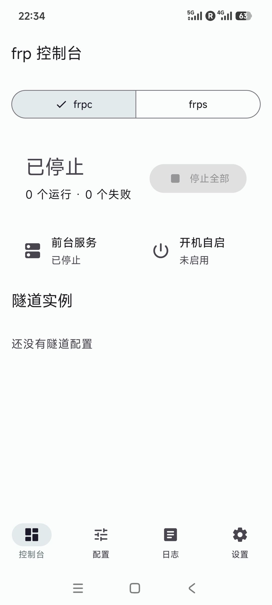
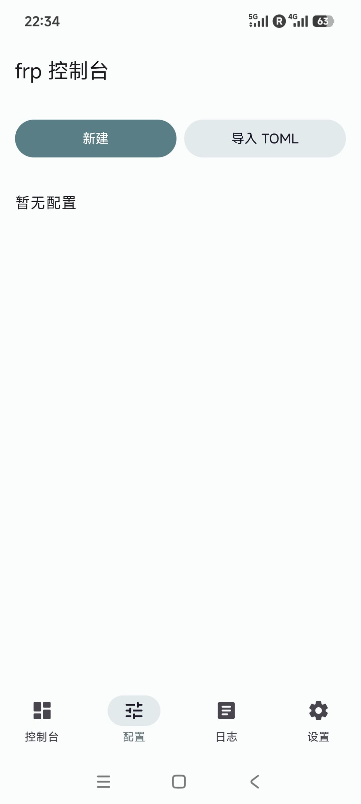
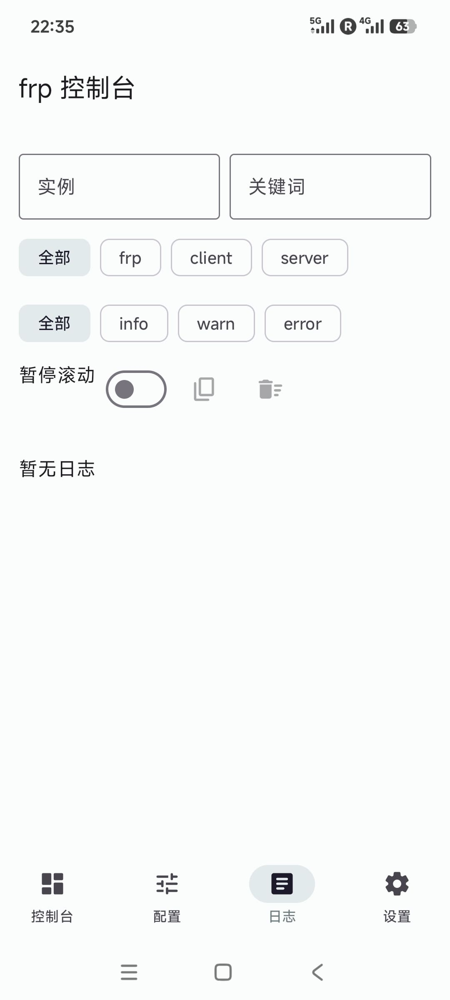
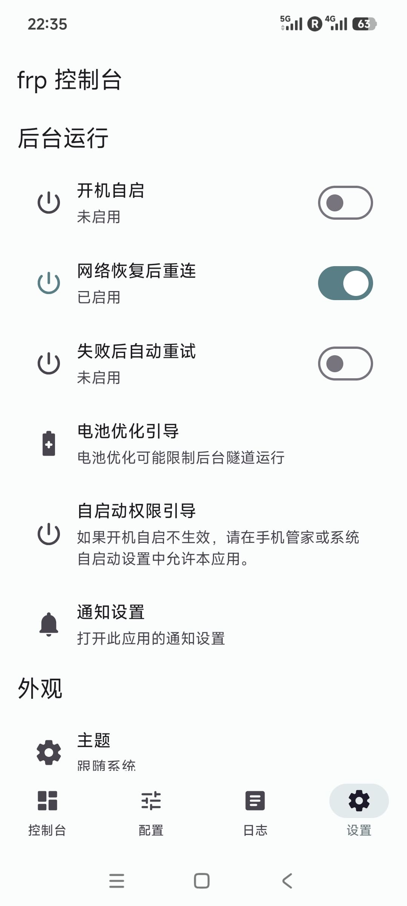
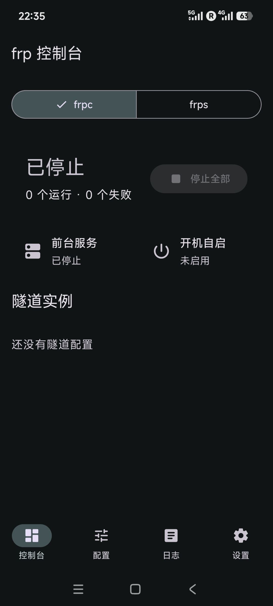
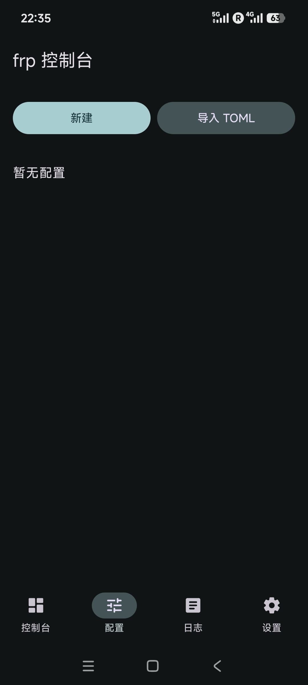
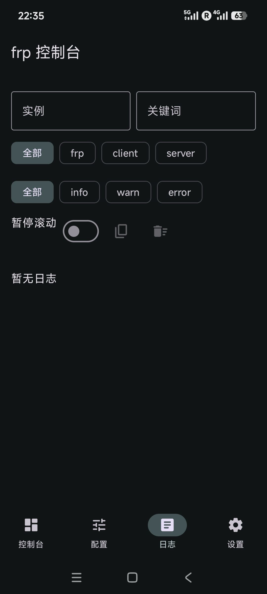
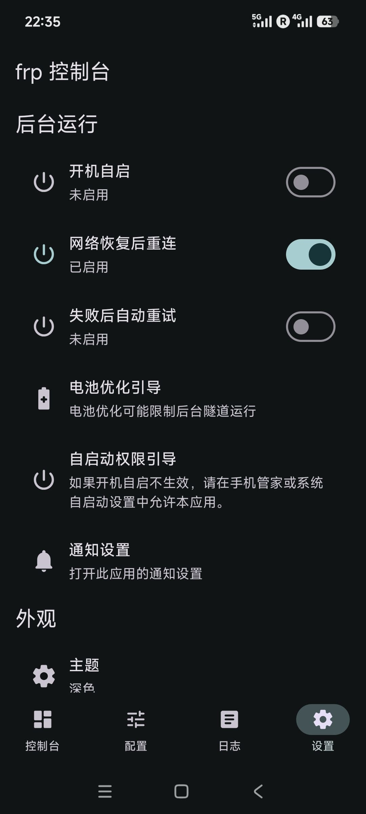

## FRP Android

轻量、现代化、原生 Android FRP 客户端。

支持在 Android 设备上运行 FRP，提供配置管理、日志查看、多架构支持以及 Material Design 3 风格界面。

## 功能特点

✅ Supports Chinese and English

✅ 支持 FRPC / FRPS 配置管理

✅ 支持启动、停止、重启实例

✅ 支持实时日志查看

✅ 支持导入 / 编辑配置文件

✅ 支持多架构设备

✅ Material Design 3 界面

✅ 前台服务运行，降低后台被杀概率

---

## 预览

<div style="display:inline-block">




</div>


<div style="display:inline-block">




</div>

---

## 下载

从 Releases 页面下载：

* Universal（通用版本）
* ARM64（推荐大多数现代设备）
* ARMv7（旧设备）
* x86_64（模拟器 / 部分设备）

---

## 快速开始

### 1. 创建配置

进入配置页面

创建新的配置文件。

支持：

* FRPC 配置
* FRPS 配置

---

### 2. 编辑配置

粘贴你的配置内容，例如：

```toml
serverAddr = "1.1.1.1"
serverPort = 7000

[[proxies]]
name = "web"
type = "tcp"
localPort = 80
remotePort = 8080
```

保存配置。

---

### 3. 启动

点击启动图标

应用将：

* 启动 FRP Runtime
* 创建前台服务
* 开始运行配置

---

### 4. 查看日志

进入日志页面

查看实时运行状态。

---

## 系统要求

* Android 6.0+
* 推荐 Android 8+

---

## 支持架构

| 架构          | 支持 |
| ----------- | -- |
| arm64-v8a   | ✅  |
| armeabi-v7a | ✅  |
| x86_64      | ✅  |
| Universal   | ✅  |

---

## 常见问题

### 后台容易被杀？

* 允许后台运行
* 关闭电池优化
* 锁定应用后台

---

### 无法连接？

建议检查：

* 配置是否正确
* 网络是否可达
* 日志页面输出

### 鸣谢

- [fatedier/frp](https://github.com/fatedier/frp)
