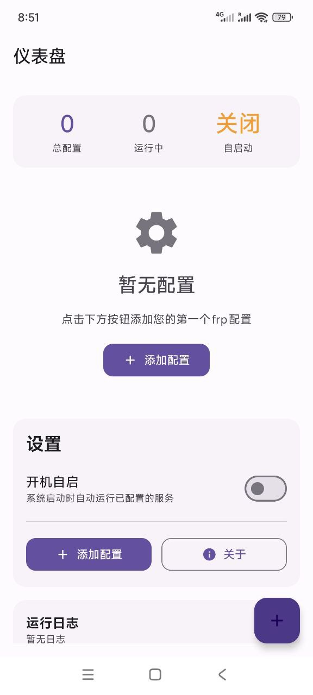

## frp-Android

一个现代化frp安卓客户端，基于[AceDroidX/frp-Android](https://github.com/AceDroidX/frp-Android)修改而来。

### 主要修改

- 重构了UI界面
- 优化了交互
- 优化电量消耗

<div style="display:inline-block">



</div>

## 技术栈

### 核心技术
- **Kotlin** - 主要开发语言
- **Jetpack Compose** - 现代化UI框架
- **Material Design 3** - UI设计规范
- **Android Architecture Components** - 架构组件

### 主要依赖
- **Compose BOM 2024.12.01** - Compose版本管理
- **Material3** - Material Design 3组件
- **Lifecycle Runtime** - 生命周期管理
- **Activity Compose** - Activity与Compose集成
- **Material Icons Extended** - 扩展图标库

### 系统要求
- **最低SDK**: Android 6.0 (API 23)
- **目标SDK**: Android 14 (API 35)
- **编译SDK**: Android 14 (API 35)

## 项目结构

```
frp-android/
├── app/
│   ├── src/main/
│   │   ├── java/io/github/acedroidx/frp/
│   │   │   ├── MainActivity.kt              # 主界面Activity
│   │   │   ├── ConfigActivity.kt            # 配置编辑Activity
│   │   │   ├── AboutActivity.kt             # 关于页面Activity
│   │   │   ├── ShellService.kt              # 后台服务
│   │   │   ├── FrpConfig.kt                 # 配置数据类
│   │   │   └── ui/
│   │   │       ├── theme/                   # 主题相关
│   │   │       │   ├── Color.kt             # 颜色定义
│   │   │       │   ├── Theme.kt             # 主题配置
│   │   │       │   └── Type.kt              # 字体样式
│   │   │       └── components/              # UI组件
│   │   │           ├── CommonComponents.kt  # 通用组件
│   │   │           ├── ConfigComponents.kt  # 配置相关组件
│   │   │           ├── StateComponents.kt   # 状态显示组件
│   │   │           ├── SettingsComponents.kt# 设置组件
│   │   │           └── SplashComponents.kt  # 启动页组件
│   │   ├── res/
│   │   │   ├── drawable/                    # 图标资源
│   │   │   ├── mipmap-anydpi-v26/          # 自适应图标
│   │   │   ├── values/                      # 资源值
│   │   │   └── values-zh/                   # 中文资源
│   │   ├── assets/                          # 资产文件
│   │   ├── jniLibs/                         # frp内核文件
│   │   └── AndroidManifest.xml             # 应用清单
│   └── build.gradle.kts                     # 应用构建配置
├── gradle/                                  # Gradle配置
├── .github/workflows/                       # CI/CD配置
└── build.gradle.kts                         # 项目构建配置
```

## 编译方法

如果您想自定义frp内核，可以通过Github Actions或通过Android Studio编译

## 常见问题

### 项目的frp内核(libfrpc.so)是怎么来的？

直接从[frp的release](https://github.com/fatedier/frp/releases)里把对应ABI的Linux版本压缩包解压之后重命名frpc为libfrpc.so  

项目不是在代码里调用so中的方法，而是把so作为一个可执行文件，然后通过shell去执行对应的命令  

因为Golang的零依赖特性，所以可以直接在Android里通过shell运行可执行文件

### 开机自启与后台保活

按照原生Android规范设计，如有问题请在系统设置内允许开机自启/后台运行相关选项

### 鸣谢

- [AceDroidX/frp-Android](https://github.com/AceDroidX/frp-Android)
- [fatedier/frp](https://github.com/fatedier/frp)