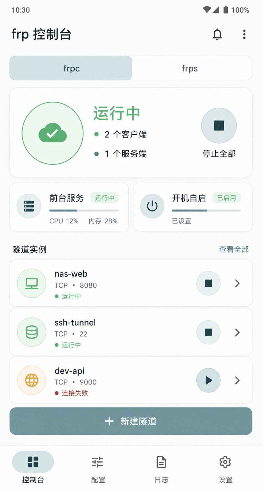

# frp Android App 设计方案

本文是基于 `frplib` AAR 的 Android App 设计方案。目标是做一个现代、美观、可长期维护的 frp 控制台 App，同时遵守 Android 真实后台运行规则。

`frplib`仓库源码：https://github.com/sky22333/frplib

已构建好的aar产物名：
frplib-arm64-v8a.aar
frplib-armeabi-v7a.aar
frplib-universal.aar
frplib-x86_64.aar




## 目标

- 直接导入 `frplib` AAR，无需手写 JNI。
- 支持官方 `frpc.toml` / `frps.toml`。
- 支持单实例和多实例。
- 支持启动、停止、Reload、StopAll。
- 支持日志回调、日志查看、日志导出。
- 支持前台服务常驻通知。
- 支持用户开启后的开机自启。
- 支持现代 Material Design 3 UI。
- 默认浅色主题，支持深色和 AMOLED。
- 支持中文和英文，默认跟随系统语言，也可在设置页手动切换。
- 不承诺绕过系统限制，不做隐藏通知和后台静默保活。

包名规范：com.sky22333.frpandroid

应用名称：frp-android

## Android 版本策略

```text
minSdk: 23
targetSdk: 跟随最新正式稳定 Android SDK
compileSdk: 跟随最新正式稳定 Android SDK
```

说明：

- Android 17 / API 37 属于未来/预览适配目标时，不应阻塞正式稳定发布。
- 正式版使用最新稳定 Android Gradle Plugin、Gradle、Kotlin、Compose BOM。

## 推荐技术栈

```text
语言：Kotlin
UI：Jetpack Compose + Material 3
架构：MVVM 或 MVI
存储：Room + DataStore
后台：ForegroundService + BootReceiver + WorkManager
依赖管理：Gradle Version Catalog
```

核心依赖：

```kotlin
implementation(platform("androidx.compose:compose-bom:<latest-stable>"))
implementation("androidx.compose.material3:material3")
implementation("androidx.compose.material:material-icons-extended")
```

`material-icons-extended` 只用于 Compose 图标。生产构建必须开启 R8，常用图标稳定后可替换成本地 vector，减少体积。

## 架构

```text
UI
-> ViewModel
-> FrpRepository
-> FrpRuntimeManager
-> FrpForegroundService
-> frplib AAR
```

规则：

- 只有 `FrpRuntimeManager` 可以直接调用 `Frplib`。
- UI 不直接调用 AAR。
- Service 只负责后台生命周期、通知和实例恢复。
- Repository 负责配置、日志和状态持久化。

建议模块：

```text
app
core-frp
core-runtime
core-data
core-ui
feature-dashboard
feature-profiles
feature-editor
feature-logs
feature-settings
```

## 数据模型

```kotlin
data class FrpProfile(
    val id: String,
    val name: String,
    val type: FrpType, // Client / Server
    val toml: String,
    val autoStart: Boolean,
    val updatedAt: Long
)

data class FrpRuntimeState(
    val id: String,
    val type: FrpType,
    val state: State, // Stopped / Stopping / Running / Failed
    val lastError: String?
)

data class FrpLog(
    val instanceId: String,
    val type: String, // client / server / frp
    val level: String,
    val message: String,
    val time: Long
)
```

TOML 原文保存，不自动格式化，不删除注释。

## frplib 使用规则

启动：

```text
setTempDir 成功 -> 保存配置 -> 校验 TOML -> 启动前台服务 -> 调用 startClientWithID / startServerWithID
```

停止：

```text
调用 stopClientWithID / stopServerWithID -> 更新状态 -> 无运行实例时停止前台服务
```

Reload：

```text
先校验新 TOML
校验失败：显示 INVALID_TOML，旧实例继续运行
校验成功：调用 reloadClientWithID / reloadServerWithID
```

错误处理：

- `""` 表示成功。
- `ALREADY_RUNNING` 视为已运行，不重复启动。
- `INVALID_TEMP_DIR` 阻断启动和 Reload，写入日志和诊断页。
- 重复 Stop 视为成功 no-op。
- `INVALID_TOML` 在编辑页展示完整错误。
- 其他错误写入日志和诊断页。

日志：

- `setLogCallback` 只注册一次。
- 生命周期日志保留 `instanceID`。
- frp 内部日志 `type = "frp"`，`instanceID` 为空。
- 日志先进入内存批量写入缓冲，再批量持久化；查询和导出统一读取数据库。

## 前台服务

App 需要一个常驻前台服务：

```text
FrpForegroundService
```

用途：

- 持续运行用户主动启动的 frp 实例。
- 提供常驻通知。
- 提供停止全部入口。
- 进程恢复后同步实例状态。

Manifest：

```xml
<uses-permission android:name="android.permission.FOREGROUND_SERVICE" />
<uses-permission android:name="android.permission.POST_NOTIFICATIONS" />
```

Android 14+ 要声明前台服务类型。frp 是用户配置的长期网络隧道，不适合作为有限时长 `dataSync` 任务。建议使用 `specialUse`，并在上架时清楚说明用途：

```xml
<uses-permission android:name="android.permission.FOREGROUND_SERVICE_SPECIAL_USE" />

<service
    android:name=".runtime.FrpForegroundService"
    android:exported="false"
    android:foregroundServiceType="specialUse">
    <property
        android:name="android.app.PROPERTY_SPECIAL_USE_FGS_SUBTYPE"
        android:value="User configured persistent frp network tunnel with visible stop notification" />
</service>
```

通知：

- 标题显示 frp 运行状态。
- 内容显示运行实例数量。
- 操作包含“打开应用”“停止全部”“查看日志”。
- 有运行实例才保持前台服务。
- 全部停止后退出前台服务。

## 开机自启

Manifest：

```xml
<uses-permission android:name="android.permission.RECEIVE_BOOT_COMPLETED" />

<receiver
    android:name=".runtime.BootReceiver"
    android:enabled="true"
    android:exported="false">
    <intent-filter>
        <action android:name="android.intent.action.BOOT_COMPLETED" />
    </intent-filter>
</receiver>
```

流程：

```text
收到启动广播
-> 检查用户是否开启开机自启
-> 找出 autoStart 配置
-> 尝试启动前台服务恢复实例
-> 如果系统或厂商限制启动，记录 pendingStart
-> 用户下次打开 App 时提示恢复
```

不要承诺所有 ROM 都能 100% 开机自启。App 需要提供电池优化和厂商自启动设置引导。

## UI 设计规范

默认浅色 Material Design 3。

视觉方向：

- 浅色、干净、柔和，统一。
- 低饱和青绿 / 蓝灰作为主色。
- 禁止大红、大蓝、大紫作为主视觉色。
- 根页面、顶部栏、底部导航、系统状态栏和系统导航栏使用同一主题背景色，不额外叠加遮罩层。
- 错误色只用于小面积提示。
- 扁平式圆角、清晰状态、低噪音。
- 禁止多层卡片叠加

推荐页面：

```text
首页
配置
日志
设置
```

首页：

- 顶部标题和 `frpc / frps` 分段切换。
- 大状态卡片显示运行中、实例数量、失败数量。
- 主按钮：启动 / 停止全部。
- 状态胶囊：前台服务、开机自启。
- 实例卡片：名称、类型、状态、最近错误、启动/停止/重启。
- 首页只负责运行控制，不放重复的新建/导入配置入口。

配置页：

- 配置列表。
- 新建入口统一收敛为一个按钮，再选择 frpc / frps。
- 导入入口统一收敛为一个按钮，再选择文件导入或粘贴 TOML。
- 编辑 TOML。
- 校验。
- 保存并重启。
- 配置列表中的开关表示开机自启，不表示立即启动或停止隧道；运行控制统一在首页完成。

日志页：

- 实时日志。
- 按实例、类型、level、关键词过滤。
- 暂停滚动。
- 复制错误。
- 清空日志必须二次确认。
- 复制、导出等一次性操作必须给出轻量反馈。
- 导出日志。

设置页：

- 开机自启。
- 通知设置。
- 电池优化提示，显示当前 App 是否已忽略电池优化，并优先引导当前 App 的系统设置。
- 主题。
- 日志保留。
- 版本信息。

## Material 3 组件

| 场景 | 组件 |
| --- | --- |
| 页面骨架 | `Scaffold` |
| 底部导航 | `NavigationBar` |
| 大屏导航 | `NavigationRail` |
| 分段切换 | `SingleChoiceSegmentedButtonRow` |
| 状态卡片 | `Card` / `ElevatedCard` |
| 实例列表 | `LazyColumn` |
| 搜索 | `SearchBar` |
| 主要操作 | `Button` |
| 次要操作 | `FilledTonalButton` |
| 危险确认 | `AlertDialog` |
| 开关 | `Switch` |
| 设置项 | `ListItem` |
| 过滤 | `FilterChip` |
| 提示 | `SnackbarHost` |

图标统一使用 `Icons.Rounded`：

```text
Dashboard：首页
Tune：配置
Article：日志
Settings：设置
PlayArrow：启动
Stop：停止
RestartAlt：重启
CloudSync：frpc
Dns：frps
Notifications：通知
PowerSettingsNew：开机自启
BatterySaver：电池优化
BugReport：诊断
```

所有图标按钮必须有 `contentDescription`。

## 动画与交互动效

动画只用于帮助理解状态变化，不做炫技。

要求：

- 页面切换使用 150ms - 250ms 的淡入、轻微位移或 shared axis。
- 启动、停止、Reload 按钮进入 loading 状态，期间禁止重复点击。
- 实例状态变化使用轻微颜色过渡和图标切换。
- 列表内容变化使用 `animateContentSize()`、`animateItem()` 或等效轻量动画。
- 日志列表不做逐条复杂动画。
- 大量日志刷新时保持滚动流畅，不触发整页重组。
- 遵守系统“移除动画”设置，用户关闭动画时减少或禁用非必要动效。

不使用：

- 大面积粒子、光效、玻璃拟态。
- 无限循环 UI 动画。
- 阻塞主线程的动画计算。
- 需要持续 GPU 高负载的装饰动画。

## 性能要求

- 冷启动首屏目标小于 1.5 秒。
- 首页只加载实例摘要，不加载完整日志。
- frplib 调用放在 `Dispatchers.IO`。
- 日志使用固定大小内存缓存。
- 日志批量写入数据库。
- 日志列表分页加载。
- Compose 列表使用稳定 key。
- 不在 Composable 内创建重对象。
- 无运行实例时停止前台服务。
- 不使用长期 WakeLock。
- 不做后台无限重试。
- 不在主线程读写文件、数据库或调用 frplib。
- 不在 Service 中保存 Activity / Context 引用。
- 所有 callback 注册必须有明确生命周期，避免重复注册和泄漏。

建议限制：

```text
内存日志：最近 1000 条
日志保留：7 天或 50 MB
失败自动重试：默认关闭
网络变化重连：使用退避策略
```

## 耗电优化

frp 是长期网络连接，耗电优化必须以“减少无意义工作”为主，而不是试图隐藏后台行为。

要求：

- 只有存在运行实例时才启动前台服务。
- 全部实例停止后立即退出前台服务。
- 不使用长期 WakeLock。
- 不使用高频定时器轮询状态。
- 通知只在状态变化、实例数量变化、错误变化时更新。
- 日志批量写入，避免每条日志触发一次数据库写入。
- 网络变化重连必须使用指数退避。
- 失败自动重试默认关闭，由用户手动开启。
- 后台日志清理使用 WorkManager，避免自建常驻线程。
- 电池优化只做用户引导，不强制、不反复弹窗。

可选设置：

```text
失败后自动重试：默认关闭
网络恢复后重连：默认开启
日志保留天数：默认 7 天
后台诊断采样：默认关闭
```

## 多语言

支持：

```text
中文
英文
```

默认语言跟随系统。设置页允许用户手动切换：

```text
跟随系统
中文
English
```

实现要求：

- 所有 UI 文案放入 `strings.xml`。
- 中文使用 `values-zh-rCN/strings.xml`。
- 英文使用默认 `values/strings.xml`。
- 不在 Kotlin 代码中硬编码 UI 文案。
- 日志原文和 frplib 错误原文不翻译，避免影响排查。
- 错误码可显示本地化标题，详情保留原始错误。
- 切换语言后不重启 native frp 实例，只刷新 UI。

## 开发规范

- 所有 AAR 调用集中在 `core-frp`。
- 所有 Service/Receiver 逻辑集中在 `core-runtime`。
- UI 只消费 ViewModel state。
- 错误码和错误消息分开解析。
- 敏感字段不写入日志。
- 导出日志默认脱敏。
- 新依赖必须说明用途。
- Compose 使用 BOM。
- 依赖版本放在 Version Catalog。
- 不使用即将弃用或已废弃的 Android API。
- 每次升级 targetSdk 前检查 Android 官方行为变更。
- 对低版本 Android 使用兼容封装，不在业务代码到处写 SDK 判断。

弃用 API 规避：

- 不使用旧版 `startActivityForResult`，使用 Activity Result API。
- 不使用旧版外部存储直读写，使用 Storage Access Framework 或 MediaStore。
- 不使用已废弃通知 API，通知通过 `NotificationCompat` 和 channel 管理。
- 不使用 AsyncTask，使用 Kotlin Coroutine / WorkManager。
- 不使用 LocalBroadcastManager，使用 Flow / repository state。
- 不使用 Material 2 组件作为主 UI。
- 不使用后台 Service 伪装常驻，长期运行必须走前台服务和可见通知。

旧版本兼容：

- Android 13 以下不请求 `POST_NOTIFICATIONS`。
- Android 13+ 首次启动前台服务前引导通知权限。
- Android 14+ 声明并校验前台服务类型。
- Android 12+ 处理后台启动前台服务限制。
- Android 8+ 创建通知 channel。
- Android 6+ 提供电池优化引导。
- 开机自启失败时记录 pendingStart，用户打开 App 后提示恢复。

## 维护规范

迭代准则：

- 功能必须完整闭环、生产可用，不以实验、演示或临时代码为交付目标。
- 实现必须直击需求根因，优先复用现有项目结构和已有组件。
- 不堆砌兜底逻辑，不用大量分支掩盖不清晰的状态设计。
- 代码量保持必要且最少。
- 不新增重复抽象、重复状态、重复入口或重复校验。
- 引入新实现时，必须同步删除被替代的旧实现、旧文案、旧状态和无用代码。
- 不保留死代码、过时注释、废弃开关和无人使用的兼容层。
- 开发前先阅读当前源码、已有 docs、相关依赖实际 API 和官方文档。
- 不凭空猜测，不依据过时博客或旧文档做实现决策。
- 设计、文档、代码、测试必须描述同一个真实行为。

发布前检查：

```text
官方 frpc.toml 启动
官方 frps.toml 启动
重复 Start 返回 ALREADY_RUNNING
重复 Stop no-op
错误 TOML 返回 INVALID_TOML
Reload 错误 TOML 不停止旧实例
StopAll 能停止全部实例
日志能回调到 App
通知能停止全部
开机自启失败时提示正确
Android 低版本 smoke test
Android 14+ 前台服务类型检查
Android 17 preview smoke test
```

升级规则：

- 升级 frplib/frp 前先跑 AAR 验收。
- 升级 targetSdk 前检查前台服务和开机自启限制。
- 升级 Compose/AGP 前跑 UI 和构建回归。
- README 只保留使用方式。
- 本文档只保留设计和工程规范。

## 资料来源

- Material 3 Compose：<https://developer.android.com/develop/ui/compose/designsystems/material3>
- Foreground service types：<https://developer.android.com/develop/background-work/services/fgs/service-types>
- Android 14 foreground service type requirement：<https://developer.android.com/about/versions/14/changes/fgs-types-required>
- Android 15 behavior changes：<https://developer.android.com/about/versions/15/behavior-changes-15>
- Notification runtime permission：<https://developer.android.com/develop/ui/views/notifications/notification-permission>
- Android Gradle Plugin release notes：<https://developer.android.com/build/releases/gradle-plugin>
